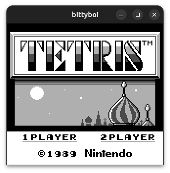

# bittyboi

A toy GameBoy emulator written in C++ and SDL.

# ToDo

* 🟢 CPU - all opcodes
* 🟠 CPU - Interrupts
  * 🟢 VBLANK
  * 🔴 LCD
  * 🟢 Timer
  * 🟢 Serial
  * 🔴 Joypad
* 🟠 PPU
  * 🟢 Background
  * 🔴 Window
  * 🔴 Sprites
* 🔴 Input
* 🔴 Sound